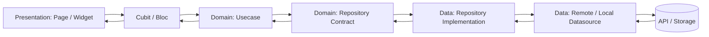

# Arsitektur Flow Kontribusi Fitur Baru

Dokumen ini dibuat untuk membantu contributor baru memahami alur kerja saat menambah fitur di aplikasi Flutter ini. Struktur proyek mengikuti pola berlapis: `presentation`, `domain`, `data`, dan `core`.

## Tujuan

- Menjaga perubahan tetap rapi dan terpisah per lapisan.
- Memudahkan review karena alur data dan tanggung jawab setiap file jelas.
- Menghindari logic bisnis ditaruh langsung di halaman UI.

## Gambaran Lapisan

### `presentation`
Tempat UI dan state management.

- `presentation/pages`: halaman, form, dan navigasi UI.
- `presentation/widgets`: komponen reusable.
- `presentation/state_management`: `Cubit`, `Bloc`, dan state.

### `domain`
Tempat aturan bisnis inti.

- `domain/entities`: model inti yang dipakai lintas lapisan.
- `domain/repositories`: kontrak repository.
- `domain/usecases`: alur bisnis per aksi atau fitur.

### `data`
Tempat implementasi sumber data.

- `data/datasources`: akses API atau storage lokal.
- `data/models`: model untuk parsing dan serialisasi.
- `data/repositories`: implementasi kontrak repository dari domain.

### `core`
Tempat kebutuhan bersama.

- `core/network`: client API, interceptor, dan konfigurasi jaringan.
- `core/theme`: warna, typography, dan style UI.
- `core/constants`: konstanta global.

## Flow Saat Membuat Fitur Baru

## Tahapan Kontribusi

### 1. Pahami kebutuhan fitur
Tentukan dulu:

- siapa user yang memakai fitur ini, misalnya siswa, tutor, atau orang tua;
- data apa yang dibutuhkan;
- apakah fitur hanya baca data atau juga mengubah data;
- apakah butuh akses API, token login, atau simpan data lokal.

### 2. Definisikan kontrak di `domain`
Buat bentuk bisnisnya dulu sebelum masuk UI.

- Tambahkan entity bila ada struktur data baru.
- Tambahkan method baru pada repository contract di `domain/repositories`.
- Tambahkan usecase di `domain/usecases` untuk satu aksi utama.

Prinsipnya: jika fitur baru adalah "ambil daftar X", maka `usecase` menerima input yang diperlukan dan memanggil `repository`.

### 3. Implementasikan sumber data di `data`
Setelah kontrak domain jelas, baru sambungkan ke API atau storage.

- Tambahkan remote datasource jika datanya dari server.
- Tambahkan local datasource jika perlu cache atau token.
- Tambahkan repository implementation untuk menjembatani domain ke datasource.
- Jika response API berbeda dari entity domain, buat model di `data/models`.

### 4. Register dependency di `dependency_injection.dart`
Semua class baru harus didaftarkan di dependency injection supaya bisa dipakai oleh layer lain.

Urutan umumnya:

- datasource;
- repository;
- usecase;
- cubit atau bloc.

### 5. Buat state management di `presentation/state_management`
`Cubit` atau `Bloc` bertugas menerima event dari UI dan memanggil usecase.

- Tambahkan state untuk loading, success, dan failure.
- Handle pesan error secara konsisten.
- Hindari logic API langsung di halaman.

### 6. Bangun UI di `presentation/pages`
Halaman hanya bertugas menampilkan data dan mengirim aksi user ke cubit.

- Buat page baru atau update page yang sudah ada.
- Pakai widget reusable jika memungkinkan.
- Pastikan form validation dan loading state jelas.

### 7. Daftarkan route di `main.dart`
Jika fitur punya halaman baru, tambahkan route di `MaterialApp.routes`.

- Gunakan penamaan route yang konsisten, misalnya `/siswa/...`, `/tutor/...`, atau `/orang-tua/...`.
- Jika page butuh dependency khusus, bungkus dengan `BlocProvider` di route.

### 8. Validasi hasilnya
Sebelum kirim PR, cek minimal:

- fitur bisa dibuka lewat route yang benar;
- state loading dan error tampil dengan benar;
- request ke API berjalan sesuai payload;
- dependency baru sudah terdaftar di `dependency_injection.dart`;
- tidak ada import yang tidak dipakai atau error analisis.

## Contoh Urutan Praktis

Misalnya menambah fitur "daftar provinsi":

1. Buat usecase `GetProvincesUseCase` di `domain/usecases`.
2. Tambahkan kontrak repository `RegionRepository` di `domain/repositories`.
3. Implementasikan `RegionRepositoryImpl` di `data/repositories`.
4. Ambil data dari `RegionRemoteDataSource` di `data/datasources`.
5. Daftarkan semua dependency di `dependency_injection.dart`.
6. Panggil usecase dari `RegionCubit`.
7. Tampilkan hasilnya di page yang membutuhkan data provinsi.

## Aturan Praktis Saat Menambah Fitur

- Jangan taruh request API langsung di page.
- Jangan pindahkan logika bisnis ke widget kecil tanpa alasan.
- Gunakan entity domain untuk data inti, bukan response mentah API.
- Jika fitur reuse di banyak halaman, letakkan logic di usecase atau cubit, bukan di UI.
- Kalau fitur butuh akses login/token, cek dulu mekanisme `AuthLocalDataSource` dan `ApiClient`.

## Checklist Sebelum PR

- [ ] Flow fitur sudah jelas dari UI sampai data source.
- [ ] Domain layer sudah ditambah jika ada aturan bisnis baru.
- [ ] Repository dan datasource sudah diimplementasikan.
- [ ] Dependency baru sudah diregistrasi.
- [ ] Route baru sudah ditambahkan jika ada halaman baru.
- [ ] State loading, success, dan error sudah dites.
- [ ] Tidak ada file yang berubah tanpa alasan.

## Catatan Struktur Saat Ini

Beberapa flow yang sudah ada di proyek ini mengikuti pola berikut:

- autentikasi ada di `data/datasources/auth_*`, `data/repositories/auth_repository_impl.dart`, `domain/usecases/auth/*`, dan `presentation/state_management/auth`;
- data wilayah ada di `data/datasources/region_remote_ds.dart`, `data/repositories/region_repository_impl.dart`, `domain/usecases/region/*`, dan `presentation/state_management/region`;
- dashboard mengikuti pola serupa melalui `dashboard_remote_ds`, `dashboard_repository_impl`, `GetDashboardDataUseCase`, dan `DashboardCubit`.

Kalau ada fitur baru, ikuti pola yang sama supaya struktur tetap konsisten.
